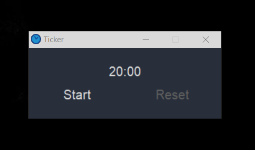
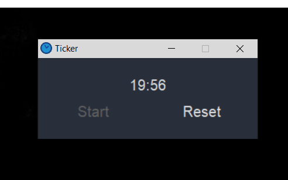
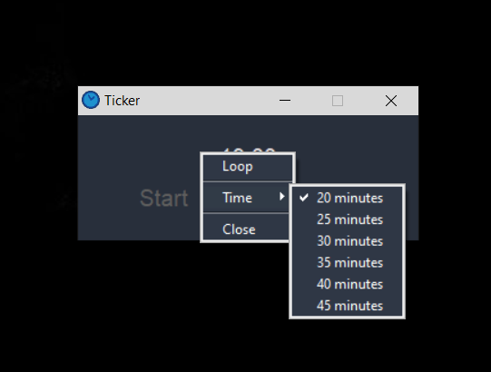
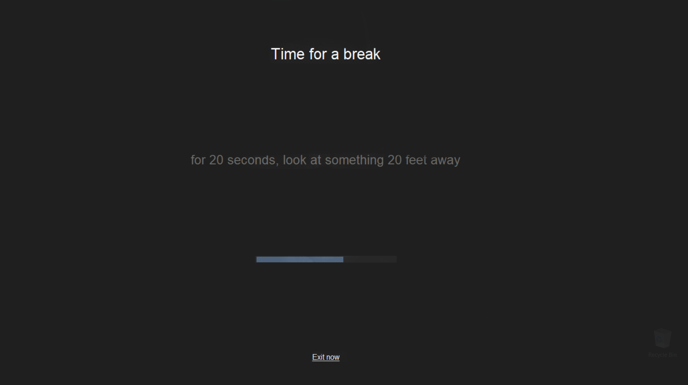

# Ticker

Ticker is a simple minimalistic timer app that helps you take a break every period of time.
 

### The dist folder contains the executable and the ico needed by the app to function.
### Source code is available in Ticker.py
  
 
 
 
Right click to choose a new time period and toggle loop functionality.

 
 
   
The screen is blocked by a transparent layer.  
